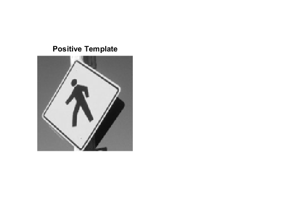

# Detection

Project delveloped for the purpose of Computer Vision [CS418] course assignment 
3 for Technical Univetsity Of Crete.  
In this assignment we develop an object detector based on gradient features and 
sliding window classification.

## Image Gradient
A function that takes a grayscale image as input and returns two arrays the 
same size as the image, the first of which contains the magnitude of the 
image gradient at each pixel and the second containing the orientation.

[mag,ori] = mygradient(I)  
The function filters the image with the simple x- and y-derivative filters. 
- Given the derivatives we can compute the orientation and magnitude of the 
  gradient vector at each pixel. 
- Used imfilter with the 'replicate' option in order to nicely handle the image 
  boundaries. 
- Visualized the resulting gradient magnitude and orientation using imagesc. 
- Used colorbar and a non-grayscale colormap in order to make the visualization 
  better. 
- Used the colormap jet for the gradient magnitude, and colormap hsv for the 
  orientation values. 

## Histograms of Gradient Orientations
A function that computes gradient orientation histograms over each 8x8 block 
of pixels. The function bins the orientation into 9 equal sized bins between 
-pi/2 and pi/2. The input of the function is an image of size HxW. The output 
is a three-dimensional array ohist whose size is (H/8)x(W/8)x9 where 
ohist(i,j,k) contains the count of how many edges of orientation k fell in 
block (i,j). 
To determine if a pixel is an edge, we need to choose some threshold. 
using a threshold that is a tenth the maximum gradient magnitude in the image 
(i.e. thresh = 0.1*max(mag(:))). Since each 8x8 block will contain a different 
number of edges, the resulting histogram gets normalized for each block to sum 
to 1 (i.e., sum(ohist,3) should be 1 at every block location). 
The function loops over the orientation bins. For each orientation it identifies 
those pixels in the image whose magnitude is above the threshold and whose 
orientation falls in the given bin. 
This is done using logical operations in order to generate an array the same 
size as the image that contains 1s at the locations of every edge pixel that 
falls in the given orientation bin and is above threshold. To collect up pixels 
in each 8x8 spatial block, the function im2col(..,[8 8],'distinct') is used. 
The im2col function will automatically pad out the image to a multiple of 8 
which is convenient.

## Detection
A function that takes a template (see the step 4) and an image and returns the 
top detections found in the image. It has the prototype 
[x,y,score] = detect(I,template,ndet)
where ndet is the number of detections to return. 
- First it computes the histogram-of-gradient-orientation feature map for the 
image, then correlates the template with the feature map. Since the feature map 
and template are both three dimensional, each orientation gets filtered 
separately and then the results summed up give the final response. This final 
response map will be of size (H/8)x(W/8). 
- Implementation of non-maxima suppression. 
Done by sorting the responses in descending order of their score. 
- Every time a detection is added to the list to return, computes overlap by 
calculating the distance between a pair of detections and checking that the 
distance is greater than say 70% of the width of the template to make sure that 
the location of this detection is not too close to any of the detections already 
in the output list.
- Returns the locations of the detections in terms of the original image pixel 
coordinates. 

## Detection Script
The provided demo detection script loads in a training image and a test image 
and has the user click on one or more patches of the training image. The script 
then builds an average template using the histogram feature map. Finally the 
script calls your detect function using this average template to detect objects 
in the test image. 

## Additional Features
Modified the provided demo detection script to add two additional features. 
- First, making the width and height of the template a variable parameter so 
that it can be easily changed to detect different size objects. Specifying the 
template size in blocks (e.g. the provided script assumes the template is 16x16 
blocks). This required a handful of changes to values that are hard-coded in the 
demo script. 
- Second, modified the script to incorporate negative training examples and 
produce a final template which is the difference of positive and negative 
averages. Negative examples can either be generated by having the user click or 
by providing a negative training image which contains no instances of the object 
and sampling random locations. 

## Results
### 1. mygradient.m output

  
  
  

### 2. Demo Detector Output

  2.1. Train image 1
  
  
  
  2.2. Patches
  
  
  
  2.3. Detection
  
  
  
  2.4. Train Image 2
  
  
  
  2.5. Patch
  
  
  
  2.6. Detection
  
  

### 3. Modified Detector Output
  3.1. Train Image
  
  
  
  3.2. Templates
  
  
  
  3.3. Detection
  
  
